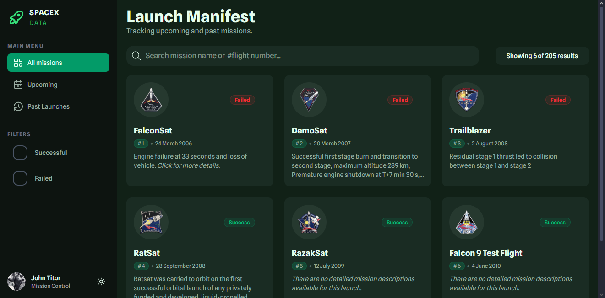
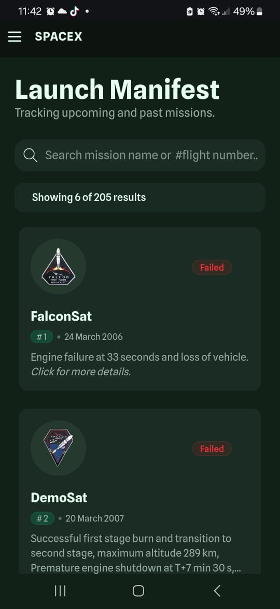

# SpaceX Mission Control Dashboard

## Architecture and Tech Stack
For this project, I decided to maintain a modular and scalable structure to ensure a clear separation of concerns across all components:
* **Folder structure**: I organized the project into:
  * ``components``: For the core UI elements, such as the sidebar and the main grid.
  * ``hooks``: Specifically for data fetching. Since this logic returns states rather than rendering JSX, a custom hook was the most efficient way to provide data to the main components.
  * ``types``: To centralize the Launch type.
  * ``utils``: For reusable helper functions, preventing unnecessary clutter in the main component files.
* **Tech Stack**: Based on the requirements and for optimal performance:
  * **React + Vite**: I chose this over Next.js because of my current experience level. While I am currently learning Next.js, I felt more confident using Vite to ensure a stable, high-quality build within the deadline without "breaking things" along the way.
  * **TailwindCSS**: Having used Tailwind in previous projects, I was able to leverage its utility-first approach effectively, referring to the official documentation only for advanced configurations.
  * **TypeScript**: This was my first time using TypeScript for a Front-end project. Given my background in JavaScript, the transition was smooth, and I found it incredibly useful for catching bugs early when passing props between components.

## AI Usage
During the development of this application, I leveraged Gemini and ChatGPT as technical partners for debugging and UI refinements:
* **UI Brainstorming**: I used **Stitch** to generate an initial UI concept, which served as a foundation. I then manually adapted the layout and adjusted the styling to meet the specific project requirements and SpaceX brand aesthetic.
* **TypeScript**: AI helped me refine my interfaces and type definitions. For instance, it suggested using more appropriate types like ``() => void`` for simple callbacks instead of more complex event types like ``React.MouseEvent<HTMLButtonElement>`` when the event object wasn't strictly necessary.
* **Problem solving**: I used AI to troubleshoot and refine complex CSS behaviors, specifically regarding responsive layout shifts and overflow issues in the modal.
* **Documentation & Readme**: **I used AI to refine the grammar and phrasing of this README**. While the ideas, technical decisions, and structure are entirely my own, the AI helped me organize my thoughts more effectively and ensure a professional tone in English.

## Design decisions
For the interface, I used a foundation inspired by Stitch, adapting its clean and modern aesthetic to fit the SpaceX brand. My focus was on balancing information density with system performance:
* **Data Selection**: I prioritized essential fields to ensure a clean UI. I deliberately avoided relational data that would require multiple API fetches, as the increased code complexity offered little additional value to the end user for this specific use case.
* **Intelligent Filtering**: Beyond the visual cues on each card, I implemented dedicated filter buttons for successful, failed, and upcoming launches. This allows users to segment the data immediately based on their interests.
* **Search Functionality**: To cater to power users, the search bar supports both mission names and flight numbers, providing a direct path to specific data without manual scrolling.
* **Pagination & Performance**: I implemented a "Load More" system, initially showing only 6 results. A dynamic "Showing X of Y" label was added to provide clear feedback, ensuring the user understands there is more data available while keeping the initial page load fast and responsive.
* **Accessibility & Themes**: I included a theme toggle. The Light and Dark modes were carefully calibrated to ensure high contrast and visual comfort regardless of the user's preference.
* **Seamless Details View (Overlay)**: To avoid page reloads and maintain the user's scroll position, I used an overlay for mission details. This view integrates the YouTube webcast and technical descriptions in a single, modern interface.
* **Mobile-First Navigation**: On smaller screens, the sidebar transitions into a hamburger menu. This keeps the viewport uncluttered while ensuring that all filtering capabilities remain accessible with a single tap.

## Challenges and Trade-offs
* **API Typing**: While the API was reliable, refining the ``Launch`` type was a significant task. Most fields were ``string | null``, requiring careful analysis to ensure the types correctly reflected the data and prevented runtime errors.
* **CSS Layouts**: I faced challenges with CSS Flexbox and Grid. Most issues weren't related to Tailwind itself but to mastering complex layouts. Through iteration, I was able to resolve these and ensure a stable structure.
* **Performance Optimization**: One of the biggest hurdles was an initial load time increase of nearly 1000ms. Recognizing this as a critical UX issue, I refactored the data loading process to be less bloated, significantly improving the response time.
* **Technical Debt (Theming)**: I identified a challenge with the Tailwind theme implementation. Currently, the light and dark theme variables are not perfectly mirrored, which increases maintenance difficulty. This is a point I plan to standardize in future iterations.
* **Development vs. Production**: I encountered some responsiveness glitches during the development phase. However, by the final deployment, I ensured all layout issues were resolved, and the live site now performs as intended across devices.

## Future Improvements & Refactoring
* **Dependencies**:
  * **Prettier**: I would integrate Prettier along with the Tailwind CSS plugin to ensure consistent syntax and code formatting across the entire team.
  * **Zustand**: To address re-rendering concerns and potential prop-drilling as the app scales, I would implement Zustand for more efficient global state management and better performance.
  * **Vitest**: Although the logic is currently stable, I would add unit tests for the filtering and data-fetching logic to ensure stability as the API or requirements evolve.

* Refactoring: I would perform a deep clean of the main ``.css`` file to remove redundant styles, improve maintainability, and fully leverage Tailwind's utility classes.